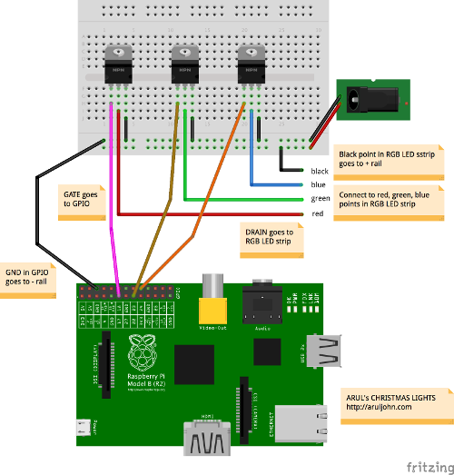

# Image 2 Leds

This script will let you send the primary colour of the current wallpaper you have to a Raspberry Pi connected to a RGB led strip.


## Requirements:

- **ColorThief**: `pip install colorthief`
- **Pigpio Library:** <u>http://abyz.co.uk/rpi/pigpio/python.html</u>


## Configuration:
#### Server (Raspberry PI)

```python
PORT = 5000	         # Port to revieve from
RED_PIN = 22		# GPIO PIN for red
GREEN_PIN = 23		# GPIO PIN for green
BLUE_PIN = 24		# GPIO PIN for blue
```

#### Client (Desktop)

```python
PORT = 5000		# Port to send to
SERVER = "192.168.1.7"	# Server address
QUALITY = 5		# Quality to get dominant color
DURATION = 15		# Time to sleep before checking again (seconds)
```


## Setting up Raspberry Pi:

You can follow these nice tutorials:

- <u>http://dordnung.de/raspberrypi-ledstrip/</u>
- <u>http://aruljohn.com/blog/raspberrypi-christmas-lights-rgb-led/ </u>

 


## Author:

- Salva Corts
- [@SalvaCorts](https://twitter.com/SalvaCorts)
- salvacortsit@gmail.com

